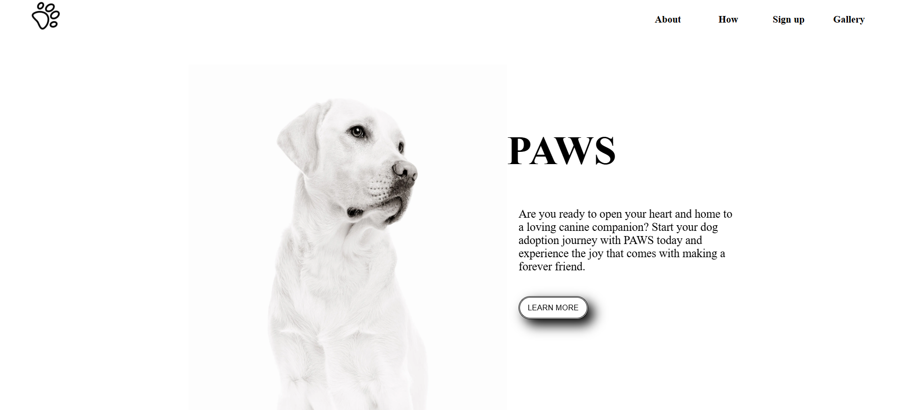
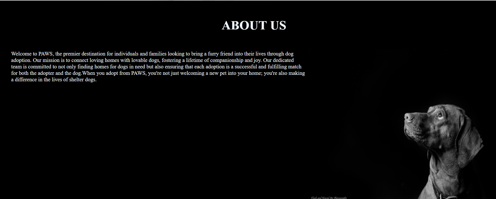
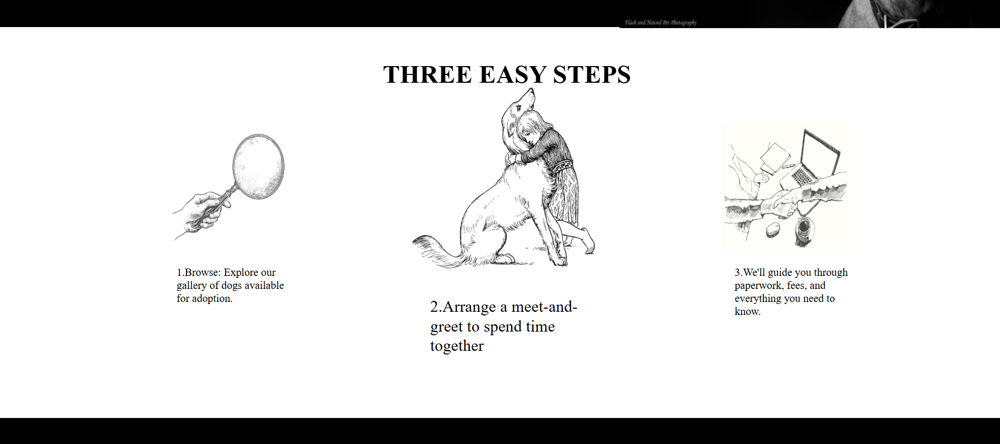
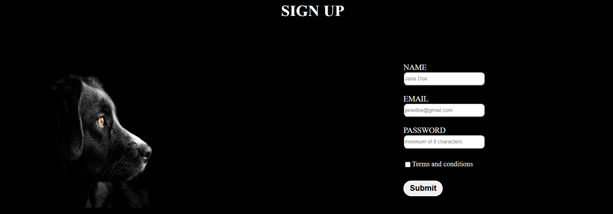
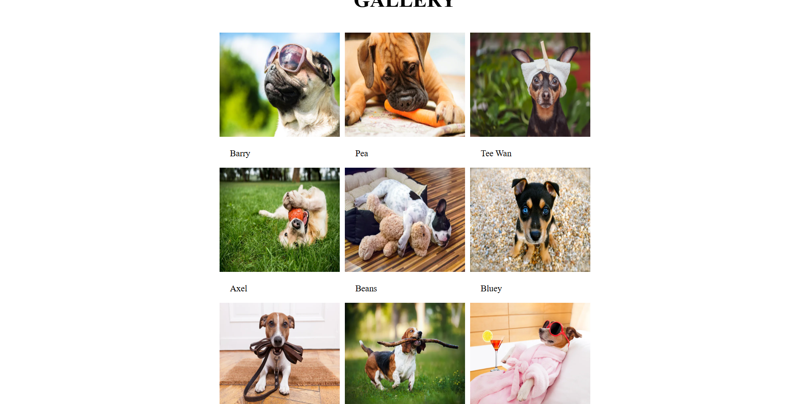

# PAWS Dog Adoption Website 🐾


*A life without pets is black and white. Adopt to fill your world with color.*

## Preview

| Section | Screenshot |
|---------|-----------|
| **Home Page** |  |
| **About Us** |  |
| **Adoption Process** |  |
| **Sign Up Form** |  |
| **Dog Gallery** |  |

## About This Project

My first frontend project practicing:
- 🧩 Flexbox layouts
- 🎯 Centering divs
- ✍️ Form validation
- 🖼️ Image galleries
- 📱 Responsive design basics

## Why Adoption Matters

Every PAWS dog brings:
- **Unconditional Love** - Tail wags and wet noses
- **Daily Joy** - Playful moments that brighten routines
- **Lifelong Friendship** - A bond that grows stronger every day

## How to Run

1. Clone the repository:
```bash
git clone [your-repo-url]